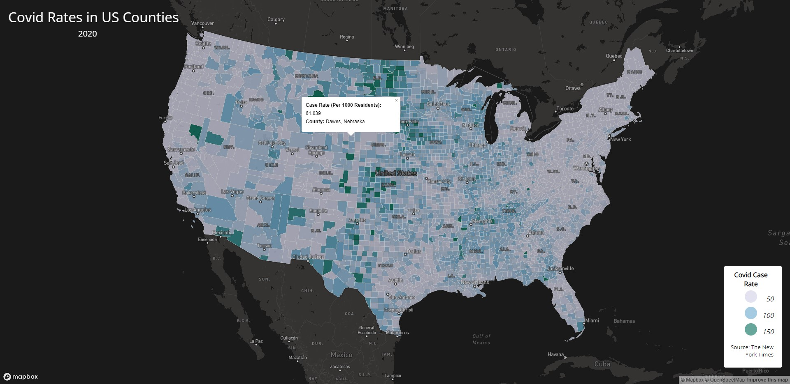
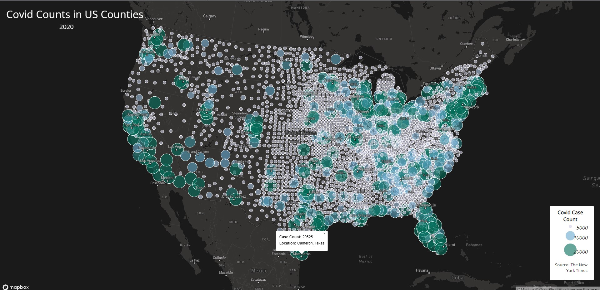

# US Covid Case Counts and Rates in 2020

This project creates a web map application using the Mapbox library, to present data on COVID-19 in the United States. The data used is originally provided by The New York Times, and have been processed to be used for this GEOG 458 lab. In this project, there are two maps: The first which visualizes COVID-19 rates in cases per one thousands residents in US counties as a choropleth, and the second which visualizes COVID-19 case counts in US Counties as a proportional symbol map. Both maps are also interactable, allowing for you to click on a point or area to create a popup displaying data about that point. These maps use basemaps provided by Mapbox. Below are links to both maps, as well as example screenshots.

## US COVID-19 Case Rates
Link: https://vinceleuw.github.io/US-Covid-Counts-and-Rates-2020/map1.html

## US COVID-19 Case Counts
Link: https://vinceleuw.github.io/US-Covid-Counts-and-Rates-2020/map2.html
